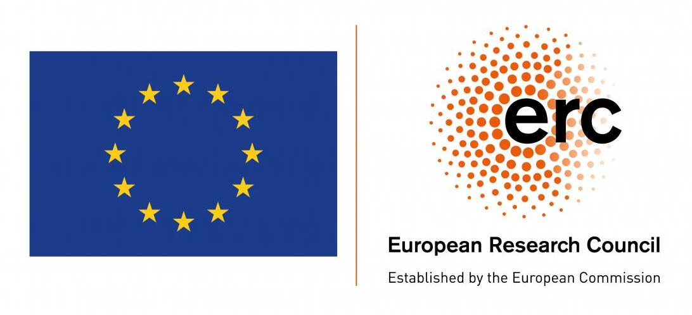
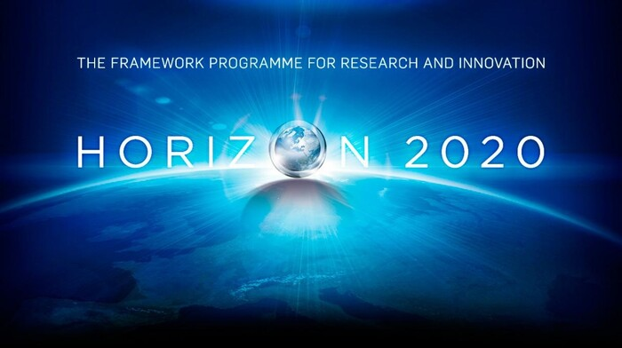

    

**Commander** is an **O**ptimal **M**onte-carlo **M**arkov ch**A**i**N** **D**riven 
**E**stimato**R** which implements fast and efficient end-to-end CMB posterior 
exploration through Gibbs sampling.

---

| [Main features](#main-features) | [Installation](#installation) | [Projects](#projects) | [Funding](#funding) | [License](#license) | [Citation](#citation) |

---

## Main Features

The latest version - `Commander3` - brings together critical features such as:

- Modern Linear Solver
- Map Making
- Parallelism
- Sky and instrumental modelling
- CMB Component Separation

`Commander3` is written using modern `Fortran` standards such as modules, sub 
modules, and object oriented derived types. The code is highly tuned and optimized 
to run on High Performance Computing (HPC) facilities, but it can also be run on 
your local machine.

The previous incarnation of **Commander**, - `Commander2` - is now an internal 
part of `Commander3`, while the first version of the code, - `Commander1` - is 
used mainly for debugging and/or legacy purposes. 

---

## Installation

For the complete installation guide please refer to the 
[official documentation](https://cosmoglobe.github.io/Commander/#/), 
where you can find how to compile and run `Commander` on different 
platforms, including HPCs such as NERSC, UNINETT Sigma2, OWLs etc. 

---

## Projects

Commander framework is part of the following projects:

     
     
     
     

---

## Funding

This work has received funding from the European Union's Horizon 2020 research 
and innovation programme under grant agreements No 776282 (COMPET-4; BeyondPlanck), 
772253 (ERC; bits2cosmology) and 819478 (ERC; Cosmoglobe).

    
    

---

## License

[GNU GPLv3](https://github.com/Cosmoglobe/Commander/blob/master/COPYING)

---

## Citation

If used for published results, please [cite these papers](https://github.com/Cosmoglobe/Commander/blob/master/docs/commander.bib):

- [Jewell et al. 2004, ApJ, 609, 1](https://ui.adsabs.harvard.edu/abs/2004ApJ...609....1J)
- [Wandelt et al. 2004, Phys. Rev. D, 70, 083511](https://ui.adsabs.harvard.edu/abs/2004PhRvD..70h3511W)
- [Eriksen et al. 2004, ApJS, 155, 227 (Commander)](https://ui.adsabs.harvard.edu/abs/2004ApJS..155..227E)
- [Eriksen et al. 2008, ApJ, 676, 10  (Joint FG + CMB)](https://ui.adsabs.harvard.edu/abs/2008ApJ...676...10E)

