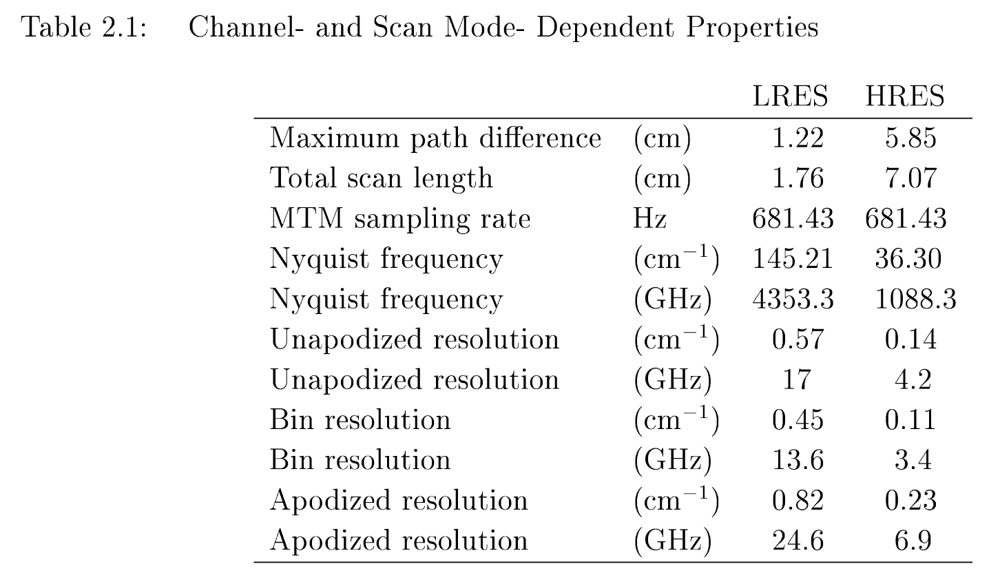
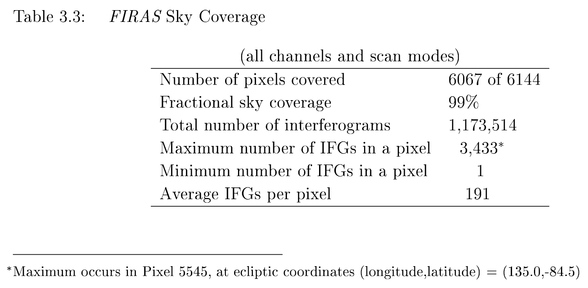
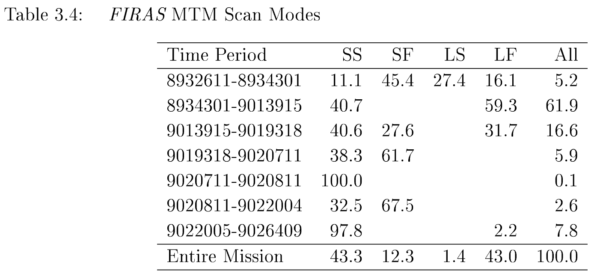
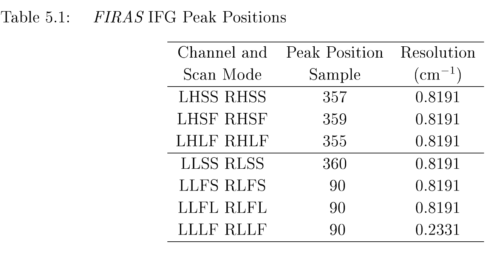

## Acronyms

| Acronym | Meaning         | Description                                                                                           | Reference                             |
| ------- | --------------- | ----------------------------------------------------------------------------------------------------- | ------------------------------------- |
| LRES    | Low RESolution  | low frequency short scan length, high frequency short scan length and high frequency long scan length | Page 13 of the Explanatory Supplement |
| HRES    | High RESolution | low frequency long scan length                                                                        | Page 13 of the Explanatory Supplement |

## Relevant tables from the Explanatory Supplement

Page 14:

Page 18: 

Page 19: 

Page 37:

