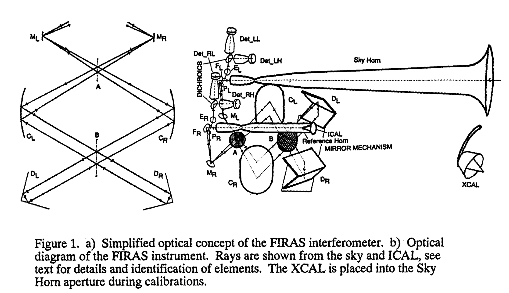
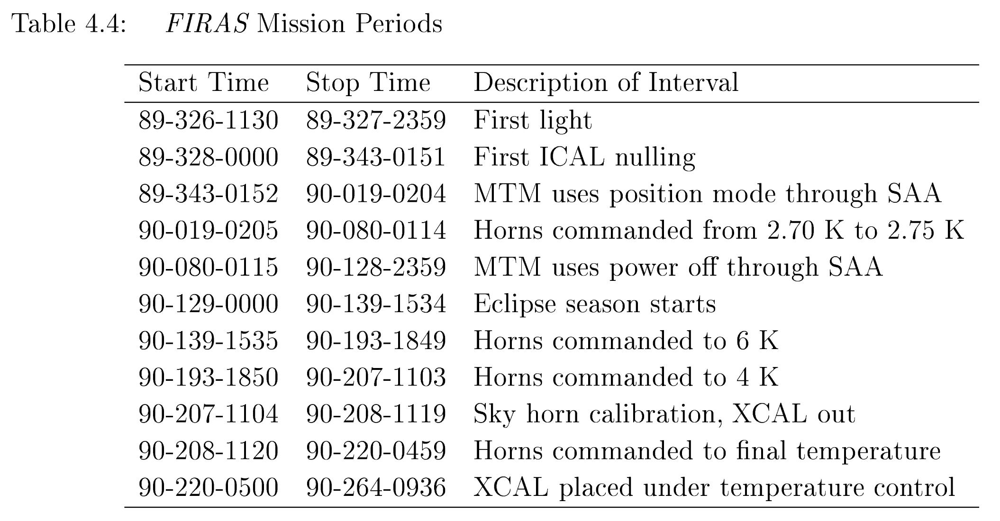
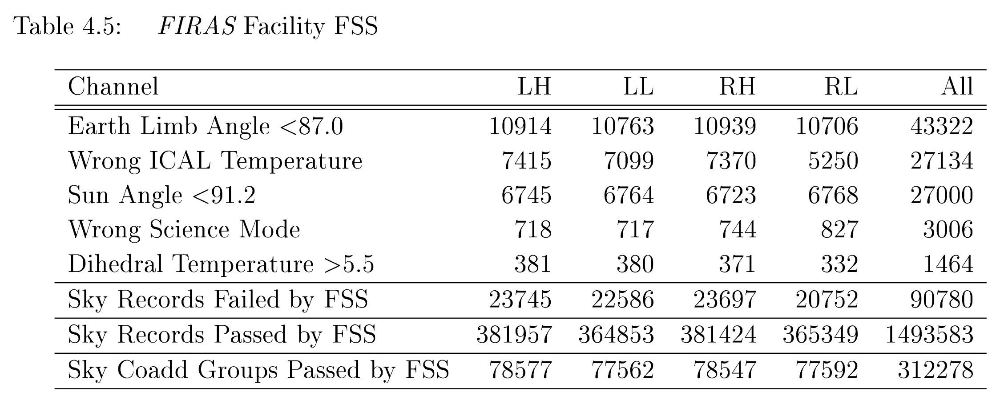
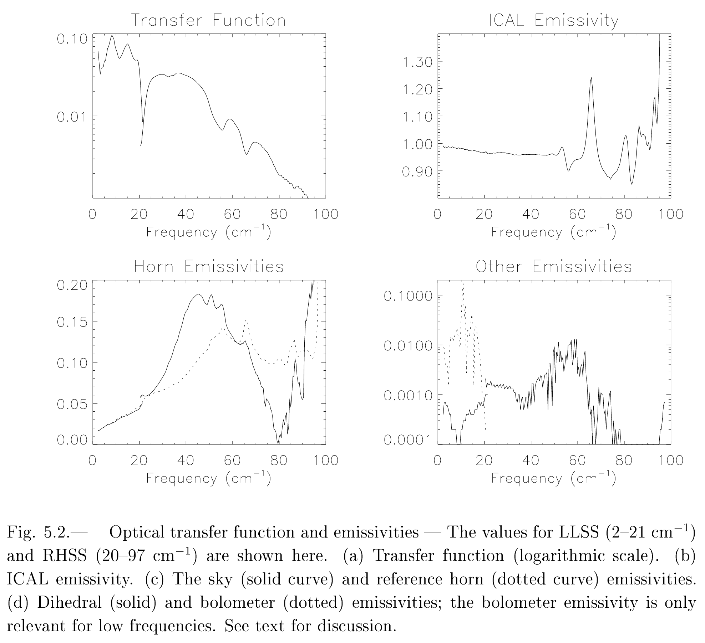
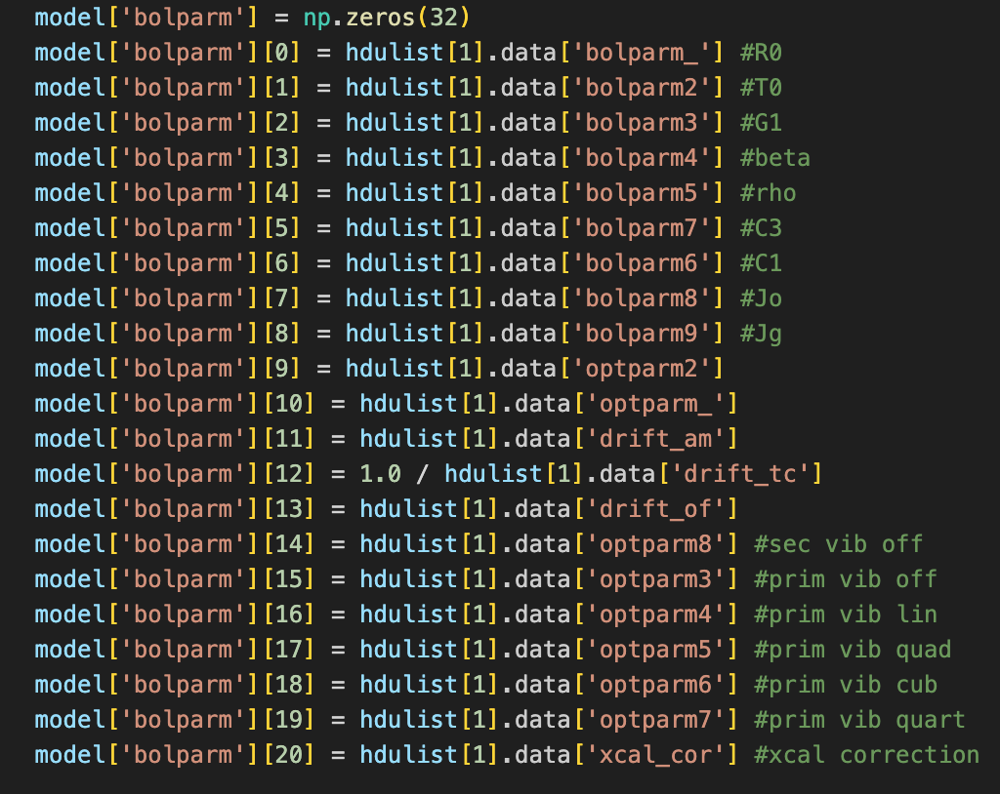

## Acronyms

| Acronym | Meaning         | Description                                                                                           | Reference                             |
| ------- | --------------- | ----------------------------------------------------------------------------------------------------- | ------------------------------------- |
| LRES    | Low RESolution  | low frequency short scan length, high frequency short scan length and high frequency long scan length | Page 13 of the Explanatory Supplement |
| HRES    | High RESolution | low frequency long scan length                                                                        | Page 13 of the Explanatory Supplement |

## Relevant tables and figures

Page 13 of Design for the COBE far-infrared absolute spectrophotometer (FIRAS):

Page 14 of Explantory Supplement:

Page 18 of Explantory Supplement:

Page 19 of Explantory Supplement: 

Pgae 27 of the Explanatory Supplement:

Page 37 of Explantory Supplement:

## Notes from the Explanatory Supplement

### General

The **frequency coverage** extends from 1 to 97 cm$^{-1}$ (30 to 2910 GHz).

The **lines detected** include the rotational sequence of CO from $J=1-0$ transition up to the $J=7-6$ transition, as well as two lines of [C I], two of [N II], and one of [C II].

The **distribution of cosmic ray glitches** is reported directly from the flight microprocessor.

The FIRAS is a scanning, four-port (two input, two output) **Michelson interferometer** that uses polarizing grids as beam splitters and creates an interferogram by scanning a movable mirror platform (the MTM). A dichroic filter at each output port (arbitrarily labeled "Left" and "Right") further splits each beam into **low** (1 - 21 cm$^{-1}$) **and high** (20 - 97 cm$^{-1}$) **frequency bands**. The four detectors are thus referred to as LH, LL, RH, RL, for "Left High", etc.

The **beam pattern** of the sky horn is designed to be circularly symmetric and unpolarized.

**Telemetered groups** of interferograms take an average of about 40 seconds to collect; the range is from $\approx$ 32 to $\approx$ 46 seconds. By design, the collection time for an IFG is about equal to the time that the instrument boresight scans across a single sky pixel.

One of the most important features of the FIRAS is that it is a **differencial device**, wherein the measured signal is determined by the difference between the spectra at the two input ports. One of the two inputs (the sky horn) is usually open to the sky, while the other (the reference horn) is filled by an internal near-blackbody reference source called the ICAL. By adjusting the ICAL temperature to a point near that of the CMBR, a near null interferogram is produced and the derived spectrum is insensitive to errors in the instrument gain.

The **orbital period** is 103 minutes, so there are almost exactly 14 orbits per day. The satellite orbit plane  precesses at a rate of 1 degree per day so as to remain roughly perpendicular to the Earth-Sun line, and the FIRAS always looks away from Earth at an angle of 91 - 94 degrees from the Sun.

As the **FIRAS scans a circle** almost perpendicular to the Sun direction, the coverage of the sky near the ecliptic poles is highly redundant, with some pixels being observed over a period of months. Conversely, pixels near the ecliptic plane are only observed during a two to five day period as the precessing orbit moves past them. 

The **incomplete sky coverage** has two primary causes. The first cause is the 3-day calibration periods (when the XCAL filled the sky horn) that were not "made up" six months later. For the first nine months of the mission calibration periods were timed to coincide with lunar apparitions every 29 days, when contamination by lunar thermal emission where the Moon was within 22 degrees of the horn would have meant that the sky data could not have been used. For the last six weeks of the mission the calibration periods were made shorter and more frequent, amount to 50% of the data taken during this period. The second cause of coverage gaps was the deliberate suspension of operation of the MTM during the passage through the South Atlantic Anomaly (SAA). For the first month of the mission particle hits on the electronics caused repeated MTM malfunctions during SAA passages, when the drive motor would continue to run after the MTM had run into a stop at the end of its stroke. The power dissipated as a result of these "end-of-travel" events would cause a spikle in the helium bath temperature, resulting in poor quality data until the bath temperature had stabilized (typically after several minutes). One month after launch, operations were changed to force the MTM into a stowed position while in the SAA, thus minimizing the occurence of the "end-of-travel" events. Three months later a further improvement was made when the MTM was powered off altogether suring SAA passages.

The calibration data taken in the sky-like near null condition with all controllables near 2.7 K show the same **noise characteristics** as the sky data. The data neartthe Galactic plane also had higher noise because the data had significant variation over a small change in position.

### Modes

The **MTM can be scanned at either two speeds**: "slow", at about 0.8 cm/s, or "fast", at about 1.2 cm/s of path difference. The interferograms ("IFG"s) are sampled at the detectors at the same clock rate in both cases (681.43 Hz), but the raw onboard samples are binned in different amounts depending on MTM scan speed so that the infrared Nyquist frequency of the telemetered data is the same.

The **MTM sweep can also be set to one of two scan lengths**, "short" or "long", whcih limit the spectral resolution. Long scans have four times the maximum optical path difference compared to short scans. In the low frequency channels, the =long scan thus yields four times the spectral resolution of the short. However, in the high frequency channel there is insufficient telemetry bandwidth to take advantage of the longer sweep, and only the first quarter of it is used. All high frequency data therefore have the same spectral resolution.

Either 16 or four sweeps (for short or long scans, respectively) are **averaged**, and the onboard sampling is set such that each telemetered IFG is 512 samples long.

The **scan speed of the MTM was toggled** between slow and fast every other orbit to allow instrumental errors to be distinguished from sky signals. At the same time the scan length of the MTM was toggled between short and long to provide higher spectral resolution (at the expense of signal to noise). In addition, the temperature of the ICAL was toggled between a "sky null" setting to a setting 12 mK hotter every 3 - 4 days to allow instrumental gain errors to be distinguished.

Because the LS scan mode was the most susceptible to MTM problems, it was not used after day 89343. The **calibration data** is 67.7% in SS, 9.3% SF, and 23.0% in LF. No clibration data were taken in the LS scan mode.

### Flags

If there are any anomalies in the values used in the **time computation**, the IFG science record is flagged as being of bad quality. The IFG is also flagged if there are telemetry data gaps or bad telemetry quality during its collection. If the values of the MTM scan speed, MTM stroke lenth and the detector gain are not constant over the IFG collection time, the iFG is flagged.

The data are divided into three groups according to the **position of the external calibrator** (XCAL). Calibration data records have the XCAL in the sky horn, while sky data records occur when the XCAL is in its stowed position and the FIRAS instrument is looking at the sky. Some data were collected while the XCAL was in transit between the sky horn and its stowed position; these records are not used. Also, a special data mode called "fake-it" was used for about 10% of of the records to conduct a variety of engineering tests; these records are also not used in further processing.

Most of the data quality checks are for engineering quantities, but very few records failed any of these during the mission. The **principal failures** are for the microprocessor status word, saturated sample counts, elevated glitch rates, and attitude.

The **microprocessor status word** contains 16 bit flags which indicate errors or anomalies detected by on-board programs during the collection of IFGs. These errors include deglitcher math overflow, command overrun, data buffer clear error, sync and ADC pulse time-outs, illegal instruction fetch, sync errors, ADC buffer over-run, sample add and divide overflows, group coadd overflow, and group divide overflow. The saturated sample count is defined as the number of ADC samples greater than or equal to 95% of the maximum ADC range. If this count is too high, the IFG is also failed. A glitch rate is computed for each IFG from a telemetry data word containing the glitch count for the IFG. A glitch rate that is too high causes the IFG to be failed.

If no **attitude solution** is available for a particular IFG, that record is failed. It is also failed if the attitude is such that the IFG might have been effected by emission from the Sun, the Moon, or the Earth limb. Calibration IFGs are not checked for attitude failures.

Ana: I think the data we have is already past this step? Past FDQ, because we have the datasets described for it (page 24/26) and also Nathan doesn't have the pipeline steps for this point.

During calibrations, series of time-ordered IFGs were obtained; these series were separated either by: a change in the commanded temperature for at least one of the four temperature-controllable bodies (the XCAL, the ICAL, the sky hron or the reference horn); or by a change in the commanded detector bias voltage. An IFG within the series is removed from the ensemble if the temperatures of any of the four conrollable bodies associated with that IFG differ from the average for the series by more than a specified tolerance. **IFGs with deviant temperatures** are classified as unstable and are removed from further pipeline processing. Many different sets of specified tolerances were used for the calibration data; as an example, the set used for the time range 900780133 to 900782047 was: XCAL .1%; ICAL .05%; sky horn .2%; and reference horn .05%. Most of the calibration records which fail stability tests are at the beginning of a series, because a controllable body which has just experienced a commanded temperature change requires a finite time to relax to its new state. The other major cause of stability failure occured following unplanned transient heatings of the sky horn by the the birght earth limb near the end of the eclipse season, when horn temperatures were 2.7 K.

It checks the sky IFG records for the following conditions, **rejecting those who do not qualify**: a solar aspect angle greater than 91.2 degrees; an earth limb greater than 87 degrees; a lunar aspect angle greater than 22 degrees; an ICAL temperature within 2 mK of one of several specified temperatures; a dihedral temperature less than or equal to 5.5 K; and a science mode of four (the standard operating science mode).

Unlike calibration data, IFGs in sky coadd groups are not tested for XCAL, sky horn, or reference horn **temperature stability**.

fex_cth.txt has tolerances.

The relative weights used to combine GRT readings for the calibration of coadded interferograms are listed in the reference data set fex_grtcoawt.txt. GRTs that are broken, non-existent, or give spurious readings have their weights set to zero, i.e. the XCAL "B" GRT and the collimator "B" GRT. GRTs that should be combined unequally are weighted accordingly. The calibration resistors also have their weights set to zero. The Sky horn B GRT shows temperature spikes due to charged particle hits, so its weight is set to zero. The calibration program a lower $\chi^2$ when the XCAL temperature is combined from the cone GRTs alone, so the XCAL A (tip) GRT has a weight of zero. The calibration program also computed a lower $\chi^2$ when the structure temperature is read from the collimator mirror alone, so the Mirror A and Mirror B GRTs have their weights set to zero. Finally, the calibration program computes a lower $\chi^2$ when the ICAL temperature is combined as 90% cone and 10$ tip, so the ICAL A GRT has a weight of 0.1 and the ICAL B GRT has a weight of 0.9. All of the other GRTs are combined with equal weights. The FIRAS GRTs have two temperature-dependent operating regimes. For the low-temperature regime, "low current" readings of the GRTs yield correct resistances and temperatures, while for the high-temperature regime, "high current" readings yield correct values. There are temperature transition regions for each GRT between these two regimes. The transition region midpoint and half-width for each GRT are listed in the reference data set fex_grtrrans.txt.

The relative weights used to combine the GRT readings for the sorting and consistency checking of the raw IFGs are listed in the reference data set fex_grtrawwt.txt. The XCAL B and Collimator B GRTs have zero weight. In general, the remaining weights are set to one since at this stage the instrument "sides" are not combined. The XCAL A and S5 GRTs are set to 0.5 for the XCAL combination, and the A side Mirror and Collimator GRTs are equally weighted for the A side structure measurement. The calibration resistors also have their weights set to zero.

### Analysis

**Deglitching** algorithm is described in page 31.

To remove the effects of internal **defocussing** of the instrument at the extrema of the MTM sweep, a fourth-order polynomial baseline is fitted to the coadd using a least squares fit and subtracted. The basis vectors for the polynomial baseline are the first five Legendre polynomials on a 512-point scale running between -255/256 and 1.0. More in fex_basis.dat.

The **transient** response from the onboard digital filters is subtracted from the first 128 points of the coadd using a least squares fit (as was previously done for each of the individual IFGs). The functional form of the digital transient response function is the Z-transform of the lowpass digital filter contained within the electronics transfer function. The FIRAS reference data set fex_dtrf.dat is a VAX binary format file which contains eight digital transient response functionrecords, each of which is a floating-point array 128 samples long. These functions are dependent on the frequency (high or low) and the scan mode (SS, SF, LS, LF) of the data.

The **spectra are converted from counts to volts** at the detector upon division by the analog-to-digital converter scale factor and by the electronics transfer function.

The **frequency scale calibration** of the FIRAS was determined from observations of the interstellar emission lines. Analysis of the [C II] and [N II] lines in the high frequency spectra shows that the frequency calibration is self-consistent to 0.005% at 60 cm$^{-1}$ (1800 GHz). Analysis of the CO lines in the low frequency spectra has shown that the frequency calibration is self-consistent to 0.03% at 15 cm$^{-1}$ (450 GHz). It is possible that there may be non-linear variations in the frequency scale due to beam divergence within the instrument. Thus, even though the [C II] and [N II] lines have better resolution the low frequency scale as used to determine the CMBR cosmic parameters. The frequency scale is set by the CO and [C I] lines observed in that data.

The temperature scale of the FIRAS was calibrated in two ways. In the first method, temperature readings from three GRTs attached to different locations on the external calibrator were averaged to produce a measure temperature of the calibrator. In the second method the calibration model included an additive correction to the measured temperature of the external calibrator. This parameter resulted in a determination of the color temperatue scale of the XCAL, which ties the calibrated frequency scale to temperatures through the form of the Planck function. This analysis gives an estimated adjustment to the FIRAS thermometer scale of -4.5 $\pm$ 1.0 mK.

### Model

Each calibration model consists of several thousand parameters (teh exact number depends on the channel). The parameters are grouped into a set of about 20 parameters describing the bolometers and general instrument; a set of $12\times n$ emissivities, where $n$ is the number of frequencies; and a set of $5\times m$ temperatures, where $m$ is the number of coadds in the calibration.

Analysis indicates that a reflectance $\sim$ 4% as seen in the ICAL can lead to significant second and third **harmonic response** in the instrument. Hence two parameters were included to model this effect. These might be different for different detectors.

**Vibrations** of the MTM at 57.57 and 8.32 Hz were detected, which led to ghost spectra around the vibration lines. These were modeled with  time varying amplitude determined by either a constant or a fourth order polynomial, depending on the channel and vibration frequency. The data frequencies translate to optical frequencies 73.5 and 10.6 cm$^{-1}$ (2203 and 318 GHz) for slow scans or 49.0 and 7.1 cm$^{-1}$ (1469 and 212 GHz) for fast scans. For the high fast data the second harmonic of the vibration (115.14 Hz) occurs at an optical frequency of 98.0 cm$^{-1}$. The second harmonic should be small relative to the main vibration but the signals at high frequencies are also small. In the high frequency slow data the second harmonic is pushed to 147 cm$^{-1}$ and even the sidebands will be strongly attenuated by 120 cm$^{-1}$ so the slow data are not contaminated in this way. Frequency offset indices are in fex_vibcorrl.txt.

The full **optical model** includes seven frequency-dependent emissions from the external calibrator, the internal calibrator, the sky horn, the reference horn, the dihedral mirrors, the structure, and the bolometers. Each of these is complex, but the total at each frequency is constrained to be zero by the Kirchoff condition. So, so there 12 free parameters at each frequency. The deep trough at $\sim$ 20 cm$^{-1}$ occurs because the low filter turns off before the reflected (high) signal turns on. Ripples at $\sim$ 55 and $\sim$ 67 cm$^{-1}$ are due to an interference effect between the polarizers. These also appear in the ICAL emissivity.

The input interferogram is defined as a function of optical path difference by the equation:

$$
I(x) = \int_{-\infty}^{+\infty} d\nu Z(\omega) B(\omega) \sum_{i=1}^N E_i(\nu) S_i(\nu) \cos(2\pi\nu x)
$$

where $x$ is the optical path difference, $\nu$ is the optical frequency in cm$^{-1}$, $\omega$ is the audio frequency in rad/s, $Z(\omega)$ is the electronics transfer function, $B(\omega)$ is the bolometer response function, and the sum over $i$ represents the contribution from $N$ sources with emissivity $E_i(\nu)$ and spectrum $S_(\nu)$. The $N$ inputs are the sky or external calibrator and various instrument components (primarily the internal calibrator).

A coadded IFG is apodized and Fourier transformed into a spectrum in counts:

$$
Y(\nu) = \int_{-\infty}^{+\infty} A(x) I(x) e^{2\pi i \nu x} dx = a(\nu) * \left(Z(\omega) B(\omega) \sum_{i=1}^N E_i(\nu)S_i(\nu)\right)
$$

where $A(x)$ is the apodization function and $a(\nu)$ is the Fourier transform of the apodization function including padding.

The spectrum in counts is normalized by the electronics transfer function to yield a spectrum in volts. The bolometer response function is computed for the spectrum based on its commanded bias, readout voltage, and bolometer temperature. The bolometer response function and the optical transfer function $H(\nu)$ (from the XCAL emission) are used to convert the spectrum from volts to MJy/sr, yielding a differential calibrated spectrum of the sky or XCAL (a spectrum of the difference in signal between the sky or XCAL and the ICAL):

$$
D(\nu) = e^{i\nu\psi} H(\nu)^{-1} \left(\frac{1}{Z(\omega)B(\omega)} Y(\nu) - C(\nu)\right).
$$

The vibration and harmonic corrections $C(\nu)$ are then applied to the differential spectrum. There is a small phase jitter in the FIRAS data which is corrected in each differential spectrum by the application of a linear autophase correction $\psi$ which is computed to minimize the imaginary part of the spectrum. It is important for high signal (i.e. far from null) data, which occurs primarily in calibration and in the high frequency channels in the Galactic plane. To account for this, they introduced a phase corrector of the form $e^{i\nu\psi}$, where $\psi$ is typically $< 10 ^{-4}$ cm but is statistically significant.

The instrument emissivities are used to compute a spectrum of the internal calibrator using Planck functions $P(T, \nu)$ of the measured temperatures of the instrument components for the source spectra:

$$
R(\nu) = H(\nu)^{-1} \sum_{i=1}^{N-1}E_i(\nu)P(T_i, \nu)
$$
where $N-1$ signifies that the source is not included in the spectrum.

Ana: What are the $N$ components and why are they all assumed to be Planck functions?

The differential spectrum and the internal calibrator spectrum are combined to produce a calibrated spectrum of the sky:

$$
S_{sky} (\nu) = D(\nu) - R(\nu).
$$

There are four known astrophysical contributors to the FIRAS spectra: the cosmic microwave background radiation, thermal Galactic dust emissions, narrow atomic and molecular lines from interstellar gas, and solar system thermal dust emission (zodiacal emission).

The galactic dust is well characterized by a modified Planck spectrum:

$$
M_{\nu p} = \tau_p \left(\frac{\nu}{\nu_0}\right)^{\alpha_p} P(\nu, T_{\text{dust};p}).
$$

The value of $\tau_p$ is a measure of the relative dust column for each pixel, though its numerical value depends on the value used for the scaling frequency, $\nu_0$, which they set to 1800 GHz. The galactic spectral form is not uniform over the entire sky, which can be modeled with pixel to pixel variations in temperature, $T_{\text{dust};p}$, and/or emissivity index, $\alpha_p$.

In the FIRAS frequency range there are a number of narrow molecular and forbidden atomic lines produced by the interstellar gas. The FIRAS instrumental resolution is large compared to the expected width of the features so that they can be treated as delta function scores. The line profile model assumes that the interferogram of each line is a simple cosine subject of self-apodization arising from beam divergence effects. The model line interferogram is:

$$
I(x) = \cos(2\pi\nu_L x)\exp\left[-\frac{1}{2}\left(\frac{\nu_L}{\nu_0}\frac{x}{\sigma}\right)^2\right]
$$

where $x$ is the optical path difference, $\nu_L$ is the line frequency, $\nu_0$ is the Nyquist frequency of the instrument, and $\sigma = 5.37$ mm is the width of the Gaussian self-apodization function.

The charged particles deposit a spike of energy in the detectors, giving rise to a delta function response on the part of the detectors. Consequently, the glitch spectrum is the product of the instrument electronics transfer function and the detector transfer function:

$$
GS(\omega) = \frac{Z(\omega)}{1 + i\omega\tau}
$$

where $\omega is the audio frequency of the instrument, $Z(\omega)$ is the electronics transfer function and $\tau$ is the detector time constant. The audio frequency $\omega$ in rad/s is relaated to the optical frequency $\nu$ in cm$^{-1}$ by the MTM scan speed $v$ in cm/s:

$$
\omega = v \nu.
$$

The glitch profile in the time domain is the inverse Fourier transform of the glitch spectrum:

$$
GP(x) = \Omega^{-1}\int_{-\infty}^{+\infty}d\nu e^{-2\pi i \nu x}\frac{Z(v\nu)}{1 + iv\nu\tau}
$$

where $\Omega$ is the normalizaton of the transform. Glitch profile records are contained in fex_gltchpro.dat.
